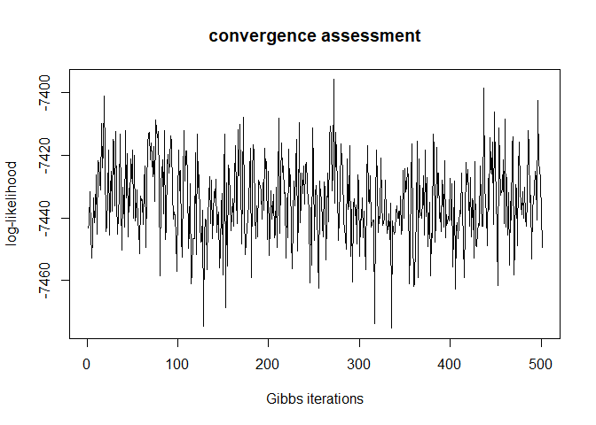
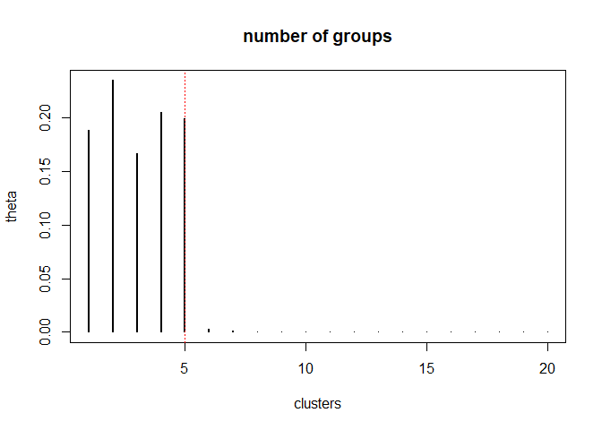
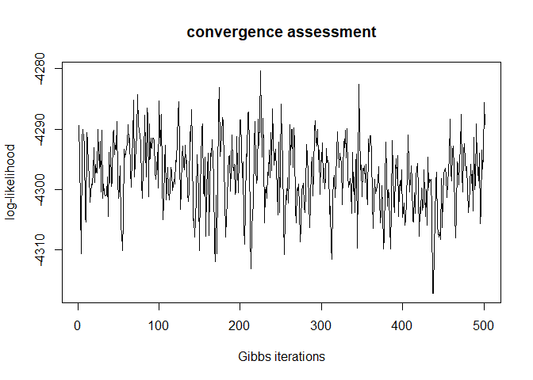
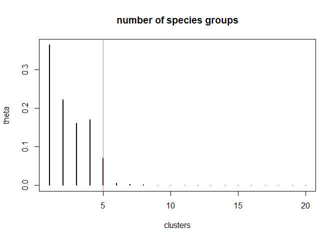

<!-- README.md is generated from README.Rmd. Please edit that file -->

# EcoCluster

The EcoCluster package implements 2 Bayesian clustering models that rely
on a stick-breaking prior to determine the optimal number of clusters,
namely:

-   mixture model
-   species archetype model (SAM)

Results from these models help to reveal the underlying structure of
highly multivariate binary data by factorizing these data in different
ways.

## Installation

You can install EcoCluster from github with the following code:

``` r
# install.packages("devtools")
devtools::install_github("drvalle1/EcoCluster")
```

We apply these two clustering methods to simulated data to showcase how
the number of groups can be successfully recovered.

## Mixture model example

We start by generating simulated data:

``` r
rm(list=ls(all=TRUE))
set.seed(1)

#general settings
nloc=300 #number of locations
nspp=50  #number of species
ngroup=5 #number of groups

#set parameters
z=sample(1:ngroup,size=nloc,replace=T)         #cluster assignment of each location
phi=matrix(rbeta(ngroup*nspp,1,1),ngroup,nspp) #species composition of each cluster  

#generate data
y=matrix(NA,nloc,nspp)
for (i in 1:nloc){
  phi1=phi[z[i],]
  y[i,]=rbinom(nspp,size=1,prob=phi1)
}
colnames(y)=paste0('spp',1:nspp)
rownames(y)=paste0('loc',1:nloc)

head(y[,1:13])
#>      spp1 spp2 spp3 spp4 spp5 spp6 spp7 spp8 spp9 spp10 spp11 spp12 spp13
#> loc1    0    1    1    0    1    1    0    1    1     1     0     0     0
#> loc2    1    0    0    1    1    0    1    1    0     1     0     1     0
#> loc3    0    0    0    0    1    1    1    0    1     1     1     0     0
#> loc4    1    1    0    0    0    1    1    1    1     0     0     0     0
#> loc5    0    1    1    0    0    1    1    0    0     1     1     0     1
#> loc6    0    0    1    1    0    0    0    0    1     1     0     1     1
```

To obtain posterior samples from the mixture model parameters, we rely
on the function `mixture.gibbs`. The user needs to specify the following
arguments:

-   `dat`: binary matrix containing the data (rows are locations and
    columns are species)
-   `ngroup`: maximum number of groups
-   `nl`: a vector with L elements (locations) containing the number of
    observation opportunities at each location
-   `ngibbs`: number of iterations for the Gibbs sampler
-   `burnin`: number of iterations to be discarded as burn-in.
-   `a.prior`: “a” parameter for prior beta distribution
-   `b.prior`: “b” parameter for prior beta distribution

``` r
library('EcoCluster')
ngibbs=1000
res=mixture.gibbs(dat=y,ngroup=50,nl=rep(1,nrow(y)),ngibbs=ngibbs,burnin=ngibbs/2,a.prior=1,b.prior=1)
```

``` r
str(res)
#> List of 5
#>  $ phi  : num [1:501, 1:2500] 0.969 0.945 0.952 0.89 0.953 ...
#>  $ theta: num [1:501, 1:50] 0.174 0.197 0.169 0.19 0.202 ...
#>  $ logl : num [1:501] -7443 -7442 -7432 -7445 -7453 ...
#>  $ z    : int [1:501, 1:300] 2 2 2 2 2 2 2 2 2 2 ...
#>  $ gamma: num [1:501] 1 0.9 0.95 0.85 0.9 0.9 0.9 0.85 0.9 0.9 ...
```

The output is a list with 5 elements:

-   `phi`: probability of observing each species in each group
-   `theta`: proportion of each location group
-   `logl`: log-likelihood
-   `z`: cluster assignment of each location
-   `gamma`: TSB prior parameter

The graph below with the log-likelihood suggests that this algorithm has
successfully converged after discarding the burn-in iterations.

``` r
plot(res$logl,type='l',main='convergence assessment',xlab='Gibbs iterations',ylab='log-likelihood')
```



The next graph shows that the algorithm successfully identified the 5
true location groups, with the remaining groups being very small or
empty.

``` r
theta=colMeans(res$theta)
plot(theta[1:20],type='h',xlab='clusters',main='number of groups',ylab='theta',lwd=2)
abline(v=5,col='red',lty=3,lwd=0.1)
```



## Species Archetype model example

We start by generating simulated data:

``` r
rm(list=ls(all=TRUE))
library('mvtnorm')
set.seed(1)

#general settings
nloc=300   #number of locations
nspp=50    #number of species
nparam=6   #number of covariates
ngroup1=5  #number of species groups

#create design matrix with covariates
xmat=matrix(rnorm(nparam*nloc),nloc,nparam)

#set parameters
alpha=rnorm(nspp,mean=0,sd=0.4) #intercept of each species
tmp=rnorm(nparam*ngroup1)
betas=matrix(tmp,nparam,ngroup1) #slope parameters for each group
cs=sample(1:ngroup1,size=nspp,replace=T) #cluster assignment for each species

#generate data assuming a probit formulation    
omega=matrix(NA,nloc,nspp)
for (i in 1:nspp){
  media=alpha[i]+xmat%*%betas[,cs[i]]
  omega[,i]=rnorm(nloc,mean=media,sd=1)
}
y=omega.true=omega
y[omega>0]=1
y[omega<0]=0

colnames(y)=paste0('spp',1:nspp)
rownames(y)=paste0('loc',1:nloc)
head(y[,1:13])
#>      spp1 spp2 spp3 spp4 spp5 spp6 spp7 spp8 spp9 spp10 spp11 spp12 spp13
#> loc1    0    1    1    1    1    1    0    0    1     0     1     1     1
#> loc2    1    0    0    0    0    0    0    1    0     0     0     0     0
#> loc3    0    1    0    1    1    0    0    0    1     0     1     1     0
#> loc4    1    1    0    1    1    1    0    1    1     0     1     1     1
#> loc5    0    1    0    0    0    0    0    0    1     1     0     0     0
#> loc6    0    0    0    0    1    1    0    0    1     0     1     1     1
```

To obtain posterior samples from the species archetype model parameters,
we rely on the function `gibbs.SAM`. The user needs to specify the
following arguments:

-   `y`: binary matrix containing the data (rows are locations and
    columns are species)
-   `xmat`: matrix containing the predictor variables (rows are
    locations and columns are predictor variables)
-   `ngroups`: maximum number of species groups
-   `ngibbs`: number of iterations for the Gibbs sampler
-   `burnin`: number of iterations to be discarded as burn-in.

``` r
library('EcoCluster')
ngibbs=1000

res=gibbs.SAM(y=y,xmat=xmat,ngroups=50,ngibbs=ngibbs,burnin=ngibbs/2)
```

``` r
str(res)
#> List of 6
#>  $ theta: num [1:501, 1:50] 0.376 0.442 0.352 0.305 0.371 ...
#>  $ logl : num [1:501] -4289 -4295 -4303 -4311 -4291 ...
#>  $ betas: num [1:501, 1:300] 0.232 0.217 0.21 0.235 0.232 ...
#>  $ alpha: num [1:501, 1:50] 0.178 0.28 0.206 0.3 0.222 ...
#>  $ cs   : int [1:501, 1:50] 4 4 4 4 4 4 4 4 4 4 ...
#>  $ gamma: num [1:501] 0.85 0.7 0.4 0.4 0.35 0.3 0.3 0.35 0.3 0.55 ...
```

The output is a list with 6 elements:

-   `theta`: probability of each species group
-   `logl`: log-likelihood
-   `betas`: slope parameters for each group
-   `cs`: cluster assignment of each species
-   `alpha`: intercept of each species
-   `gamma`: TSB prior parameter

The graph below with the log-likelihood suggests that this algorithm has
successfully converged after discarding the burn-in iterations.

``` r
plot(res$logl,type='l',main='convergence assessment',xlab='Gibbs iterations',ylab='log-likelihood')
```



The next graph shows that the algorithm successfully identified the 5
true species groups.

``` r
theta=colMeans(res$theta)
plot(theta[1:20],type='h',xlab='clusters',main='number of species groups',ylab='theta',lwd=2)
abline(v=5,col='red',lty=3,lwd=0.1)
```


